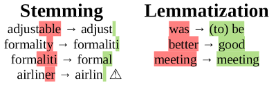

# Natural Language Processing
* **Natural language processing (NLP)**: It is the branch of artificial intelligence that helps computers understand, interpret and manipulate human language. 
* NLP draws from many disciplines, including computer science and computational linguistics, in its pursuit to fill the gap between human communication and computer understanding.
* For Working with NLP we can use two types of approaches **1. Word level**, **2. Character level**.

### Libraries we used for NLP
* We usually use these libraries in NLP, which are:
  * NLTK (Natural language Tool kit)
  * TextBlob
  * CoreNLP
  * Polyglot
  * Gensim
  * SpaCy
  * Scikit-learn
  * And the new one is **Megatron library** launched recently.


### Tokenization
* Tokenisation is the act of breaking a sequence of strings into pieces such as words, keywords, phrases, symbols and other elements called tokens. 
* Tokens can be individual words, phrases or even whole sentences. 
* In the process of tokenisation, some characters like punctuation marks are discarded.

```
'Natural Language Processing'
['Natural', 'Language', 'Processing']
```
### Stemming
* **Stemming**: It is the process of reducing inflexions in words to their root forms such as mapping a group of words to the same stem even if stem itself is not a valid word in the Language.

|    | Word        | StemWord |
|----|-------------|----------|
| 0  | Connect     | Connect  |
| 1  | Connections | Connect  |
| 2  | Connection  | Connect  |
| 3  | Connects    | Connect  |
| 04 | Connected   | Connect  |

### Lemmatisation
* **Lemmatisation**: It is the process of the group together the different inflected forms of the word so that they can be analysed as a single item. It is quite similar to stemming, but it brings context to the words. So it links words with similar kind meaning to one word.



### Bag-of-words model
* We need the way to represent text data for the machine learning algorithms, and the bag-of-words model helps us to achieve the task.
* It is the way of extracting features from the text for the use in machine learning algorithms.
* In this approach, we use the tokenised words for each of observation and find out the frequency of each token.
* Let’s do an example to understand this concept in depth.
```
“It is going to rain today.”
“Today, I am not going outside.”
“I am going to watch the season premiere.”
```
* We treat each sentence as the separate document and we make the list of all words from all the three documents excluding the punctuation.
* We get- 
```
[‘It’, ’is’, ’going’, ‘to’, ‘rain’, ‘today’ ‘I’, ‘am’, ‘not’, ‘outside’, ‘watch’, ‘the’, ‘season’, ‘premiere.’]
```
* The next step is the create vectors. Vectors convert text that can be used by the machine learning algorithm.
* We take the first document — **“It is going to rain today”**, and we check the frequency of words from the ten unique words.
```
“It” = 1
“is” = 1
“going” = 1
“to” = 1
“rain” = 1
“today” = 1
“I” = 0
“am” = 0
“not” = 0
“outside” = 0
```
* Rest of the documents will be:
```
“It is going to rain today” = [1, 1, 1, 1, 1, 1, 0, 0, 0, 0] 
“Today I am not going outside” = [0, 0, 1, 0, 0, 1, 1, 1, 1, 1] 
“I am going to watch the season premiere” = [0, 0, 1, 1, 0, 0, 1, 1, 0, 0]
```
In this approach, each word (a token) is called a “gram”. Creating the vocabulary of two-word pairs is called a bigram model. The process of converting the NLP text into numbers is called vectorisation in ML. There are different ways to convert text into the vectors :
• Counting the number of times that each word appears in the document.
• I am calculating the frequency that each word appears in a document out of all the words in the document.


## spaCy:
* This is completely optimized and highly accurate library widely used in deep learning.


## NLP-NLTK
